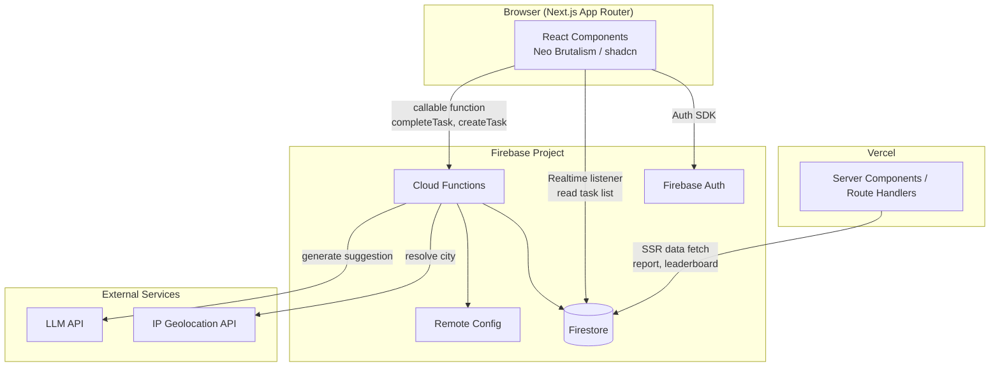
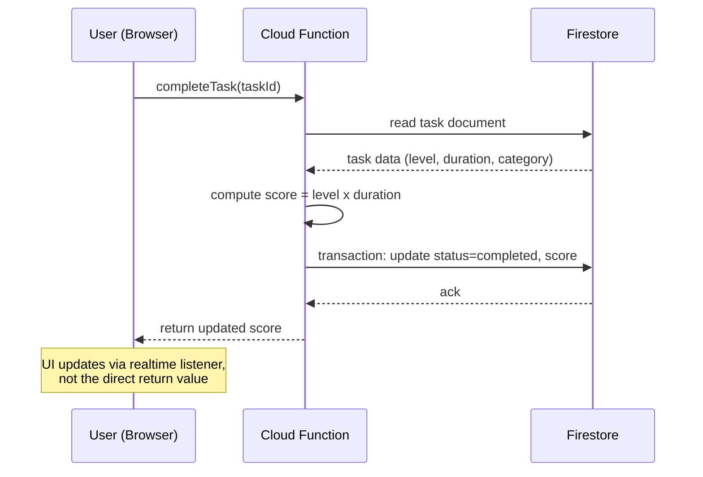

# Architecture Document

## 1. Architecture Style

BaaS-centric architecture: Next.js acts as the frontend (App Router, deployed
to Vercel), talking directly to Firebase services for most operations
(realtime reads, auth) and through Cloud Functions for operations that need
centralized business logic or scheduled jobs.

**Why not a custom backend (a separate Express/Nest server)**: this app's scope
(task CRUD, scoring, reports, leaderboard) does not need an always-on backend
server. Firestore + Cloud Functions cover all business logic with no separate
server to maintain, which cuts operational overhead. Trade-off: higher Firebase
vendor lock-in than a custom backend, but for a small/solo project this is a
reasonable trade-off for development speed.

**Why host Next.js on Vercel instead of Firebase Hosting**: Firebase Hosting
supports Next.js, but its App Router support (server components, streaming,
ISR) is more limited than Vercel's, which is built by the Next.js team itself.
Cloud Functions run in the Firebase project regardless of where the frontend
is hosted, so there is no significant downside to hosting the frontend
separately from the backend.

## 2. High-Level System Diagram



## 3. Frontend Architecture (Next.js)

### 3.1 Routing Structure

```
src/app/
  (auth)/
    login/page.tsx
    register/page.tsx
  (app)/
    layout.tsx              -> shared nav, auth guard
    home/page.tsx
    report/page.tsx
    leaderboard/page.tsx
    profile/page.tsx
```

The `(app)` route group uses a layout that runs the auth check in a server
component (redirects to `/login` when unauthenticated). The `(auth)` group is
separate so it never inherits that layout.

### 3.2 Server vs Client Components

| Content | Type | Why |
|---|---|---|
| Task list (home) | Client | Needs realtime updates (`onSnapshot`) when tasks are added/completed |
| Daily/weekly report | Server Component (initial fetch) + client for small interactions | Report data needs no realtime; server-fetching shrinks the client bundle and loading states |
| Leaderboard table | Server Component | Data only changes at week end; no need for a realtime listener burning Firestore connections |
| Profile form | Client | Interactive (edit form, avatar upload) |

General principle: default to Server Components, drop to Client Components only
when interactivity or realtime data is required. This ships less JavaScript to
the browser than an all-client-side SPA pattern.

### 3.3 State Management

- **Realtime data** (the current day's task list): a thin custom hook over
  Firestore `onSnapshot`, wrapped as `useTasks(date)`. No extra state library
  needed — the Firestore SDK already handles the subscription lifecycle.
- **Non-realtime data** (reports, leaderboards): fetched in server components,
  or with a light SWR layer on top when client-side refetch/caching is needed.
  No full React Query for this scope.
- **Global UI state** (modal open/close, toast, theme): Zustand, one small
  store. Redux was rejected as overkill for state this simple — it would add
  boilerplate with no real benefit at this scale.

## 4. Backend Architecture (Firebase)

### 4.1 Why Task Completion Is Not Written Directly from the Client

Task completion produces a score, and scoring has fairly complex business rules
(level x duration, per-task cap, 24h daily aggregate cap). Validating this
logic through Firestore Security Rules alone has two problems:

1. Security rules cannot easily run aggregate queries (summing every task's
   duration on the same date) for daily-cap validation.
2. Scoring logic would be split: partly on the client (for UX, score preview),
   partly in rules (for enforcement). Every formula change would have to be
   made in two places.

**Decision**: task creation and completion that affect scores go through
**Cloud Functions callable functions**, not direct Firestore writes from the
client.

- `createTask(input)`: validates input, checks the daily aggregate cap (queries
  the same-date existing tasks inside a Firestore transaction), saves the task
  with `pending` status.
- `completeTask(taskId)`: computes the score from level x duration, flips the
  status to `completed`, writes the final score. Runs in a Cloud Function with
  the Admin SDK, so security rules can deny direct client writes to `status`
  and `score` entirely.

Firestore Security Rules stay simple: users may only read their own tasks, and
create/update is limited to non-sensitive fields (e.g. title while still
pending). Every score-related mutation goes through a Cloud Function.

### 4.2 Scheduled Cloud Functions

| Function | Trigger | Responsibility |
|---|---|---|
| `taskCutoverJob` | Cloud Scheduler, hourly | Finds users whose local midnight falls in that hour (from the timezone stored on their profile) and flips their overdue `pending` tasks to `missed` |
| `weeklyCycleJob` | Cloud Scheduler, **fixed global cron** (default `0 0 * * 1` — Monday 00:00 UTC) | 1) Compute each user's weekly report (balance index, completion rate). 2) Run leaderboard matching (city -> province fallback). 3) Compute each group's leaderboard scores. 4) Assign top-3 badges. 5) Generate the rule-based suggestion, trigger AI enhancement when enabled |

**Why a global UTC cron instead of per-user timezones like `taskCutoverJob`**:
one leaderboard group holds users from different cities that may sit in
different timezones. With per-user week boundaries, two members of the same
group could compete in unsynced windows (user A's week already closed while
user B's is still running) — that breaks leaderboard fairness. The week
boundary must be one global point in time for the whole system. The cron time
itself is fixed at deploy time (Cloud Scheduler cannot read Remote Config in
realtime to decide when to trigger), unlike the weighting constants which can
be tuned via Remote Config because they are read when the function executes,
not when its trigger fires.

**Why an hourly job for task cutover instead of per-minute or strictly
per-user realtime**: minute precision is unnecessary for an "end of day" use
case — up to ~1 hour of delay is product-acceptable. An hourly job is far
cheaper and simpler than precise per-user scheduling, which would need
infrastructure like per-user Cloud Tasks schedules (overkill here).

### 4.3 Remote Config for Tunable Constants

The following constants live in Firebase Remote Config, fetched by Cloud
Functions (server-side, never the client) so they can be tuned without
redeploying and cannot be read/manipulated from the browser:

- `dailyDurationCapHours` (default 24)
- `perTaskDurationCapHours` (default 16) — flat cap, same for push and pause
  (`PRD.md` Section 5.2)
- `balanceWeightFloor`, `balanceWeightRange` (defaults 0.5, 0.5)
- `completionWeightFloor`, `completionWeightRange` (defaults 0.5, 0.5)
- `aiReportEnabled` (global kill switch, separate from the per-user profile
  setting)

### 4.4 External Service Abstraction

Both the IP geolocation and LLM APIs are called through thin interfaces inside
Cloud Functions (`services/geolocation.ts`, `services/aiSuggestion.ts`), never
directly from business logic. The goal: swapping providers (e.g. moving off
ip2location.io, or changing LLM provider) never touches `weeklyCycleJob` code.
Recommended providers for the MVP:

- **IP Geolocation**: [ip2location.io](https://www.ip2location.io). Notes that
  affect implementation:
  1. **The free plan (with an API key) allows 50,000 queries/month**, with HTTPS
     support (unlike ip-api.com, which was considered earlier and is HTTP-only
     on its free tier). Without a key (keyless), the limit is far smaller
     (1,000 queries/day) — so **register and use an API key from day one**,
     not the keyless endpoint.
  2. **No explicit commercial-use ban** was found on the free plan (unlike
     ip-api.com), but this was not verified directly against their official
     Terms of Service — before the production launch, read the full ToS to make
     sure using it in a (potentially) commercial product does not violate the
     free plan.
  3. **The free plan hard-stops when the monthly quota is exhausted** (not a
     throttle/degrade, but a full stop until next month's reset). This is a
     different risk shape than ip-api.com's per-minute throttle: here the risk
     is running out mid-month if the user base grows fast. Since city
     resolution happens once per user per weekly cycle (not per request),
     50,000/month covers roughly 12,000 weekly active users (assuming 4–5
     weekly cycles per month) — generous enough for an MVP, but quota usage
     needs monitoring and alerting before the limit so city resolution does not
     suddenly start failing mid-`weeklyCycleJob`.
  4. **Fallback when the quota runs out**: `weeklyCycleJob` needs graceful
     degradation — if a geolocation call fails on quota, that user should be
     skipped from that week's matching (not fail the whole job), logged for
     retry, or notified to enter their city manually as a temporary override.

  The provider is still called through the abstraction layer
  (`services/geolocation.ts`) so it can be swapped if these limits become real
  blockers.
- **AI suggestion**: called through the LLM API with a tight timeout (e.g. 10
  seconds) and automatic fallback to the rule-based suggestion when the call
  fails or times out. A report must never fail entirely just because the AI
  enhancement is having problems.

## 5. Authentication Flow

1. The user picks a login method: email/password or OAuth (Google, GitHub, X).
2. The Firebase Auth SDK handles the flow on the client (popup/redirect for
   OAuth).
3. On success, the `onAuthStateChanged` listener in the root layout stores the
   auth state.
4. **First-time login**: check whether the user profile document already exists
   in Firestore (`users/{uid}`). If not, create it and ask the user to complete
   their city (for cases where IP geolocation fails); auto-detect the timezone
   via `Intl.DateTimeFormat().resolvedOptions().timeZone` on the client, sent
   once during onboarding.
5. Server Components for protected pages verify the session through the
   Firebase Admin SDK (session cookie, not just the client-side ID token) so
   SSR knows the auth status before rendering.

**Technical note on X (Twitter) OAuth**: the provider ID in the Firebase Auth
SDK is still `twitter.com` (legacy naming). Re-check during implementation
whether the SDK version in use has changed anything, since X rebranded from
Twitter long ago.

## 6. Data Flow: Task Completion (Detail)



## 7. Security Architecture

- **Firestore Security Rules**: default deny. Users may only read their own
  documents (tasks, reports, badges). Writes to `score`, `status: completed`,
  and the entire `leaderboard`/`badges` collections are rejected from the
  client — only the Admin SDK (Cloud Functions) may write those fields.
- **Secrets**: API keys for IP geolocation and the LLM provider live in Cloud
  Functions environment config / Secret Manager, never exposed to the client
  bundle.
- **Rate limiting**: callable functions (`createTask`, `completeTask`) need
  Firebase App Check to block abuse from outside the official app (not just
  relying on the auth token).

## 8. Decisions on the PRD Section 14 Open Items

| PRD item | Decision |
|---|---|
| Leaderboard weighting formula constants | Firebase Remote Config (Section 4.3), not hardcoded |
| Task cutover timezone handling | Timezone stored per-user on the profile, hourly scheduled job (Section 4.2) |
| IP geolocation provider | ip2location.io (free plan, 50,000 queries/month with API key) for the MVP, behind a service abstraction (Section 4.4). Verify commercial-use ToS before production launch |
| Manual city override | **In scope** for the MVP. The profile settings city field is manually editable and overrides IP geolocation results. Rationale: cheap to implement (one form field), immediately reduces user pain when IP geolocation misdetects |

## 9. Scalability Considerations

- Leaderboard grouping (14 users per group) means queries must be partitioned
  per group, not scan the whole users collection. Leaderboard group data is
  structured as a per-cycle sub-collection — details in `DATABASE.md`.
- Firestore composite indexes are needed for task queries by `userId + date`
  and `userId + status`.
- A `weeklyCycleJob` that processes every user at once can become a bottleneck
  with a large user base. For the MVP, run it as one batched function with
  pagination (N users per batch). With significant growth, consider splitting
  into a task queue (Cloud Tasks) per user/group.

## 10. Testing Strategy (Summary)

- Cloud Functions (scoring business logic, cap validation, balance formula):
  unit tests with the Firebase Emulator Suite, since this is the most
  correctness-critical and calculation-bug-prone part.
- Firestore Security Rules: separate tests with `@firebase/rules-unit-testing`.
- Frontend: component tests for form validation (task creation); skip full
  end-to-end in the early phase to save development time, add it once the app
  is stable.

## 11. Project Structure

```
src/app                  -> Next.js App Router
  (auth)/
  (app)/
  components/
    ui/                  -> shadcn/neobrutalism components
  lib/
    firebase/            -> client SDK init, hooks (useTasks, useAuth)
/functions               -> Firebase Cloud Functions (TypeScript)
  src/
    callable/            -> createTask, completeTask
    scheduled/           -> taskCutoverJob, weeklyCycleJob
    services/            -> geolocation.ts, aiSuggestion.ts
/shared                  -> TypeScript types used by both app and functions (Task, Report, ...)
firestore.rules
firebase.json
```

**Note on `/shared`**: Firebase Functions deploy separately from the Next.js
app, so the `/shared` folder needs to be copied into `functions/` at build
time (via a small build script) — not monorepo tooling like Turborepo/Nx,
which is overkill for two build targets. If duplicating a few small types
feels simpler than an extra build step, manual duplication is fine for a few
basic interfaces (Task, WeeklyReport).

## 12. Risks Summary

- **Firebase vendor lock-in**: migrating to another backend later will be
  expensive. Accepted as a development-speed trade-off at this stage.
- **IP geolocation accuracy**: mitigated with the manual override, but residual
  risk remains of users landing in the wrong leaderboard group.
- **ip2location.io monthly quota**: the free plan hard-stops at 50,000
  queries/month, not a gradual throttle. Quota monitoring plus graceful
  degradation in `weeklyCycleJob` (Section 4.4) is required so an exhausted
  quota cannot fail the whole weekly cycle. Commercial-use ToS also needs
  verification before production launch.
- **AI API dependency**: mitigated with the rule-based fallback — no single
  point of failure for the report feature.
- **`weeklyCycleJob` as a single critical point**: if the job dies mid-run
  (e.g. an error at user 500 of 1000), it needs an idempotency and resume
  strategy, not a restart from scratch. This needs more detailed design during
  implementation and is logged as a technical risk not yet fully solved at the
  architecture level.

## 13. Next Steps

Continue to `DATABASE.md` for Firestore collection details, document
structures, and composite indexes based on the data flows defined here.
