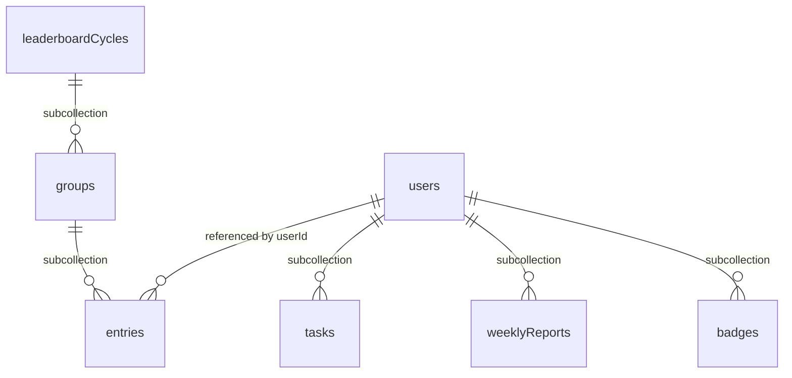

# Database Schema (Firestore)

## 1. Design Principles

- **Per-user subcollections** for data scoped 1:1 to a single user (tasks,
  weekly reports, badges). This is the idiomatic Firestore pattern for
  owner-scoped data: security rules stay simple (`request.auth.uid == userId`
  in the path), and no composite index is needed to filter by `userId` since it
  is already implicit in the path.
- **Top-level collections** only for naturally cross-user data (leaderboard
  cycles, since one group holds 14 different users).
- **`date` is stored as an ISO string (`YYYY-MM-DD`)**, not a Firestore
  `Timestamp`. Rationale: tasks belong to a calendar date in the user's
  timezone, not a second-precise point in time. With `Timestamp`, every
  "today" query would need a range query plus timezone conversion that is easy
  to get wrong (off-by-one-day bugs when timezones are handled inconsistently).
  A `YYYY-MM-DD` string makes equality and range queries straightforward and
  timezone-safe at the data level.
- **Derived fields (`utcResetHour`) are stored directly**, not recomputed on
  every job run. Explained in Section 3.

## 2. Collections Overview

## 3. `users/{uid}`

| Field | Type | Notes |
|---|---|---|
| `displayName` | string | |
| `email` | string | from Firebase Auth |
| `avatarUrl` | string \| null | |
| `city` | string | IP geolocation result, or manual override |
| `cityManualOverride` | boolean | true once the user has edited it manually; used so `weeklyCycleJob` never overwrites an overridden city with a fresh IP geolocation result |
| `timezone` | string | IANA timezone string, e.g. `"Asia/Jakarta"`; auto-detected during onboarding, editable in settings |
| `utcResetHour` | number (0-23) | **derived field**, computed from `timezone` on create/update: the UTC hour corresponding to the user's local midnight. Stored directly (not recomputed every job run) so `taskCutoverJob` can query `where utcResetHour == currentHour` without loading every user and computing timezones one by one, every hour |
| `aiReportEnabled` | boolean | default `true`; per-user toggle for the AI-enhanced suggestion |
| `currentGroupId` | string \| null | denormalized from the running cycle's `leaderboardCycles/{cycleId}/groups/{groupId}`, written by `weeklyCycleJob` after matching finishes. Avoids an expensive collection group query every time the user opens the leaderboard page — see `API.md` Section 9 |
| `createdAt` | Timestamp | |
| `updatedAt` | Timestamp | |

**Note on `utcResetHour`**: for timezones with non-whole-hour offsets (e.g.
India at UTC+5:30), hourly-job granularity means the cutover can land up to 30
minutes off true midnight. This is consistent with the `ARCHITECTURE.md`
decision that minute precision is unnecessary for this use case.

## 4. `users/{uid}/tasks/{taskId}`

| Field | Type | Notes |
|---|---|---|
| `category` | `"hustle"` \| `"humble"` | |
| `title` | string | |
| `level` | number (1-5) | pressure (hustle) or restoration (humble) |
| `durationHours` | number | decimals allowed |
| `date` | string `YYYY-MM-DD` | see rationale in Section 1 |
| `status` | `"pending"` \| `"completed"` \| `"missed"` | |
| `score` | number \| null | null while `pending`, filled by the Cloud Function on `completed` |
| `createdAt` | Timestamp | |
| `completedAt` | Timestamp \| null | |
| `missedAt` | Timestamp \| null | filled by `taskCutoverJob` |

**All writes to this collection go through Cloud Functions** (`createTask`,
`completeTask`, `taskCutoverJob`), never direct client writes — per the
`ARCHITECTURE.md` Section 4.1 decision. Security rules allow `read` for the
owner only and reject all client `write`s.

**Cap validation**: when `createTask`/`updateTask` runs, the Cloud Function
checks two Remote Config thresholds: `perTaskDurationCapHours` (flat, default
16h, against the task's own `durationHours`) and `dailyDurationCapHours`
(default 24h, against the total duration of all tasks on the same date). The
daily cap uses a **Firestore aggregation query (`sum()`)**, not fetching every
document and summing in code — far cheaper in read cost, since an aggregation
query does not count as full document reads. Error contract details live in
`API.md` Sections 2–3.

## 5. `users/{uid}/weeklyReports/{weekId}`

`weekId` uses the ISO week format: `"2026-W36"`.

| Field | Type | Notes |
|---|---|---|
| `weekId` | string | redundant with the document ID, also stored as a field so it stays usable in collection group queries if ever needed |
| `startDate` / `endDate` | string `YYYY-MM-DD` | |
| `hustleScore` / `humbleScore` / `totalScore` | number | |
| `balanceIndex` | number (0-100) | formula in `PRD.md` Section 7.2 |
| `completedTasksCount` / `missedTasksCount` | number | |
| `completionRate` | number (0-1) | |
| `ruleBasedSuggestion` | string | always filled |
| `aiSuggestion` | string \| null | null when `aiReportEnabled == false` or the LLM call fails |
| `generatedAt` | Timestamp | |

Written by `weeklyCycleJob`; read-only from the client side.

## 6. `leaderboardCycles/{cycleId}`

`cycleId` equals `weekId` (e.g. `"2026-W36"`) for consistency across
collections.

| Field | Type | Notes |
|---|---|---|
| `weekId` | string | |
| `startDate` / `endDate` | string | |
| `status` | `"matching"` \| `"scoring"` \| `"completed"` | tracks `weeklyCycleJob` progress; used for resuming if the job dies mid-run (see the risk in `ARCHITECTURE.md` Section 12) |
| `createdAt` | Timestamp | |

### 6.1 `leaderboardCycles/{cycleId}/groups/{groupId}`

| Field | Type | Notes |
|---|---|---|
| `locationLevel` | `"city"` \| `"province"` | result of fallback matching (`PRD.md` Section 8.2) |
| `locationName` | string | |
| `memberCount` | number | |
| `status` | `"pending"` \| `"scored"` | |

### 6.2 `leaderboardCycles/{cycleId}/groups/{groupId}/entries/{uid}`

| Field | Type | Notes |
|---|---|---|
| `userId` | string | redundant with the document ID, stored as a field so it can be queried via **collection group query** (e.g. "find all entries of user X across all time" without knowing their `cycleId`/`groupId`) |
| `displayName` | string | denormalized from `users/{uid}` — lets the client show names without reading other people's user documents (whose rules are owner-only) |
| `avatarUrl` | string \| null | denormalized from `users/{uid}` |
| `city` | string | denormalized from `users/{uid}` |
| `weeklyRawScore` | number | from that user's `weeklyReports` of the same week |
| `balanceIndex` | number | |
| `completionRate` | number | |
| `balanceWeight` | number | computed from `balanceIndex` with the Remote Config constants |
| `completionWeight` | number | computed from `completionRate` with the Remote Config constants |
| `leaderboardScore` | number | `weeklyRawScore x balanceWeight x completionWeight` |
| `rank` | number \| null | filled after every entry in the group is computed |

## 7. `users/{uid}/badges/{badgeId}`

| Field | Type | Notes |
|---|---|---|
| `tier` | `"gold"` \| `"silver"` \| `"bronze"` | |
| `cycleId` | string | reference to `leaderboardCycles` |
| `groupId` | string | |
| `locationName` | string | denormalized from the group, so the profile page needs no extra read to show "Gold — Jakarta, week 36" |
| `awardedAt` | Timestamp | |

## 8. Required Composite Indexes

| Collection (path) | Fields | Used for |
|---|---|---|
| `users/{uid}/tasks` | `status ASC, date ASC` | `weeklyCycleJob` counting completed/missed tasks per week (status filter, date range) |
| `users` (top-level) | `utcResetHour ASC` | `taskCutoverJob` finding users whose local midnight falls in the running UTC hour |
| `entries` (collection group) | `userId ASC` | finding one user's leaderboard entry history across cycles, used in profile/badge history |

Other indexes (single-field equality like `date == X` on tasks) are already
covered by Firestore's default single-field indexes — no need to define them
manually.

## 9. Security Rules Summary

Full rules live separately in `firestore.rules`, but these are the principles
to hold during implementation:

- `users/{uid}`: **read** by the owner. **Client writes rejected**
  (`allow write: if false`); all profile updates (including `timezone`, which
  needs `utcResetHour` recomputed consistently) go through the `updateProfile`
  callable function. This avoids the case where `timezone` changes but
  `utcResetHour` is left stale by a direct client write.
- `users/{uid}/tasks/{taskId}`: **client read-only**, all writes rejected
  (`allow write: if false`). Every mutation goes through a callable Cloud
  Function with the Admin SDK.
- `users/{uid}/weeklyReports/{weekId}`: client read-only.
- `users/{uid}/badges/{badgeId}`: client read-only.
- `leaderboardCycles/**`: reads **restricted to members of the relevant
  group**, not blanket-open to every authenticated user. "Public among group
  participants" (`PRD.md` Section 8) means members of the same group can see
  each other — not that any user in the app can scan other groups' scores they
  never joined. A blanket-open rule would let anyone scan the whole national
  leaderboard across groups, which serves no product purpose and widens data
  exposure for nothing. The concrete implementation (membership check via a
  field on `groups/{groupId}` or on the `entries` documents themselves) is
  detailed when writing `firestore.rules` in M6/M7, not a blocker for moving
  to the next phase. Writes stay fully rejected from the client regardless of
  group membership.

## 10. Deliberately Not Separate Collections

- **Daily report**: no `dailyReports` collection. A daily report is produced by
  querying `users/{uid}/tasks where date == X` directly when the report page
  opens — one day's tasks are small enough to need no precomputed cache.
- **Remote Config values** (weighting constants, daily cap): not Firestore
  documents — they stay in Firebase Remote Config per `ARCHITECTURE.md`
  Section 4.3.

## 11. Next Steps

Continue to `API.md` to define the callable function contracts (`createTask`,
`completeTask`) and the response shapes the frontend consumes.
