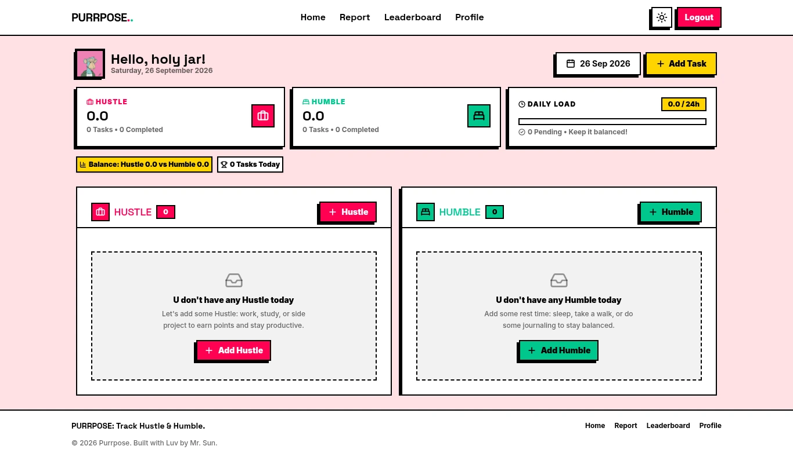
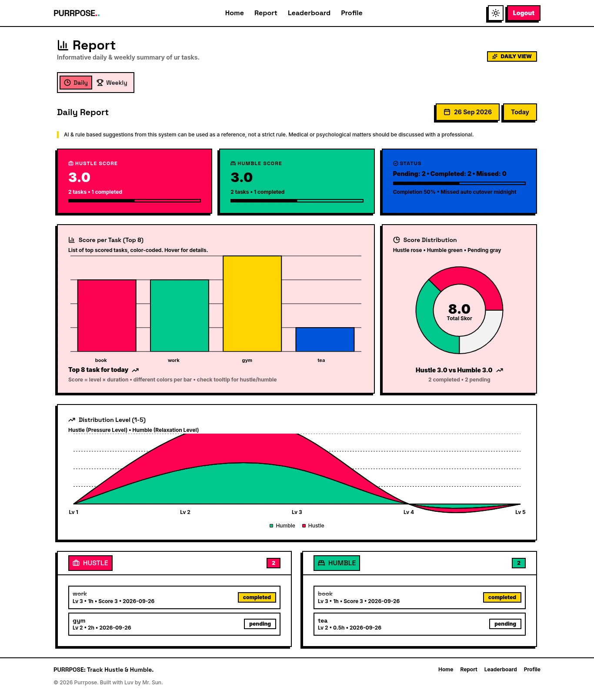
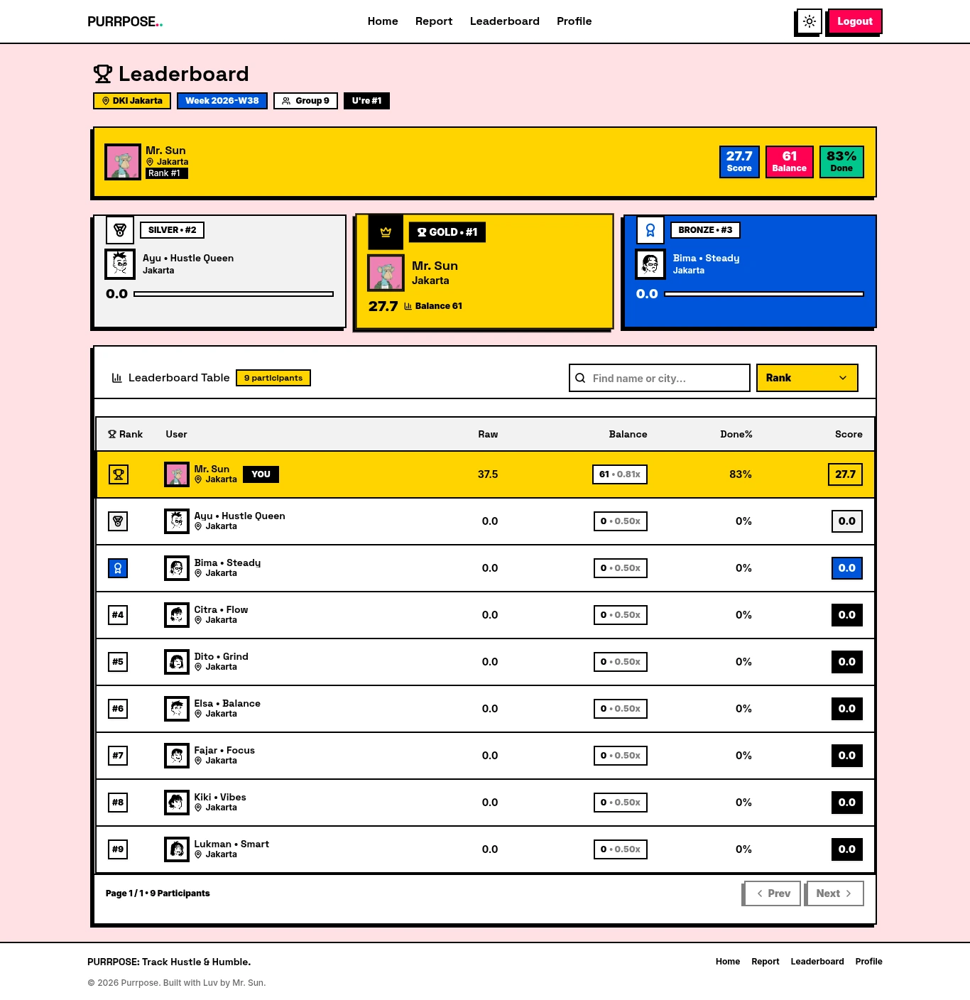

# 🐾 Purrpose

> Track your hustle. Honor your humble. Balance is the ultimate productivity hack.

**Try it live:** [purrpose.mhmdfjr.com](https://purrpose.mhmdfjr.com)

Purrpose is a gamified productivity web app. It splits your daily tasks into two
categories - **Hustle** (work, study, build) and **Humble** (rest, reflection,
recharge) - and rewards you for keeping them in **balance**, not for grinding
yourself into the ground. Unfinished tasks are never punished; they simply roll
over with a friendly nudge.

---

## 📸 Screenshots

### 🏠 Home: your daily Hustle & Humble boards



### 📊 Report: scores, charts & weekly balance



### 🏆 Leaderboard: city ranks & badges



---

## 🙌 For Users

### 🚀 How it works: 3 steps

1. **Add a task, mark it done.** Pick a category (Hustle/Humble), a level
   1–5, and a duration. Done = score of `level × duration` added instantly.
   Not done = "have no time", never "failed".
2. **Check your Balance 0–100.** The weekly report blends your Hustle/Humble
   scores with rule-based + AI-enhanced suggestions (powered by Google Gemini).
3. **Climb the leaderboard.** Weekly city-based groups (~15 people). Top 3 earn
   collectible **Gold / Silver / Bronze** badges.

### ✨ Key features

- **Task management** - create, edit, complete, and delete daily tasks with
  level (1–5) and duration tracking
- **Fair scoring** - points from intensity × duration, with anti-grind daily
  caps (16h per task, 24h per day)
- **Daily & weekly reports** - charts for task distribution, score breakdown,
  and balance metrics
- **AI suggestions** - personalized weekly tips, clearly labeled as reference
  (not medical advice)
- **City leaderboards** - weighted scoring that factors in balance and
  completion rate, not just raw points
- **Dark mode, PWA-ready** - installable, works offline-first UI with theme
  toggle

### ❓ FAQ

- **Am I punished for unfinished tasks?** No. They are marked "have no time"
  and excluded from scoring - Purrpose measures what you did, not what you
  didn't.
- **Is my data private?** Your tasks are visible only to you. Leaderboards show
  only your display name, city, and score.
- **Does it cost anything?** The app is free and
  [open source (MIT)](LICENSE) - you can even self-host it (see below).

---

## 🛠️ For Developers

### 🧱 Tech stack

| Layer        | Technology                                        |
| ------------ | ------------------------------------------------- |
| **Frontend** | Next.js 16, React 19, TypeScript, Tailwind CSS v4 |
| **UI**       | shadcn/ui, Radix UI, Neo Brutalism design system  |
| **Backend**  | Firebase (Firestore, Auth, Cloud Functions)       |
| **AI**       | Google Gemini 1.5 Flash                           |
| **Testing**  | Vitest, Firebase Rules Unit Testing               |
| **Deploy**   | Vercel (frontend) + Firebase (backend)            |

## 🏁 Getting Started

### 📋 Prerequisites

- Node.js 20+
- A Firebase project (enable Authentication, Firestore, Cloud Functions)
- API keys: [ip2location.io](https://www.ip2location.io/) (free), [Google Gemini](https://ai.google.dev/) (free tier)

### 📦 Installation

```bash
git clone https://github.com/mhmdfjr/purrpose.git
cd purrpose
npm install
```

### 🔑 Environment Variables

Copy `.env.example` to `.env.local` and fill in the values:

```bash
cp .env.example .env.local
```

| Variable                                   | Description                                 |
| ------------------------------------------ | ------------------------------------------- |
| `NEXT_PUBLIC_FIREBASE_API_KEY`             | Firebase API key                            |
| `NEXT_PUBLIC_FIREBASE_AUTH_DOMAIN`         | Firebase auth domain                        |
| `NEXT_PUBLIC_FIREBASE_PROJECT_ID`          | Firebase project ID                         |
| `NEXT_PUBLIC_FIREBASE_STORAGE_BUCKET`      | Firebase storage bucket                     |
| `NEXT_PUBLIC_FIREBASE_MESSAGING_SENDER_ID` | FCM sender ID                               |
| `NEXT_PUBLIC_FIREBASE_APP_ID`              | Firebase app ID                             |
| `FIREBASE_SERVICE_ACCOUNT`                 | Firebase Admin SDK service account JSON     |
| `IP2LOCATION_API_KEY`                      | ip2location.io API key for geolocation      |
| `GEMINI_API_KEY`                           | Google Gemini API key for AI suggestions    |
| `CRON_SECRET`                              | Random secret for Vercel cron authorization |

See `.env.example` for the full list including optional App Check and emulator variables.

### 💻 Development

Start the Next.js dev server:

```bash
npm run dev
```

To run with Firebase emulators (Auth, Firestore, Functions):

```bash
npm run emulators:build
```

Open [http://localhost:3000](http://localhost:3000).

## 🧪 Testing

```bash
npm test              # Run all tests
npm run test:unit     # Unit tests only
npm run test:rules    # Firestore security rules tests
```

## 🚢 Deployment

### 🌐 Frontend (Vercel)

Push to `main` for Vercel auto-deploys. Cron jobs for task cutover and weekly cycles are configured in `vercel.json`.

### 🔥 Backend (Firebase)

```bash
firebase deploy --only functions,firestore:rules,firestore:indexes
```

## 📄 License

[MIT](LICENSE)
